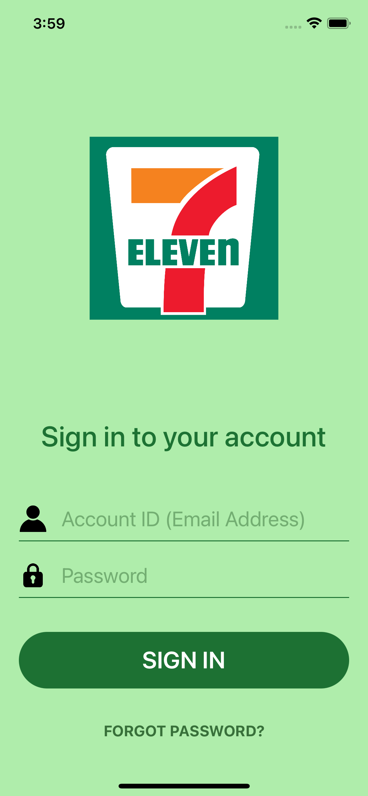
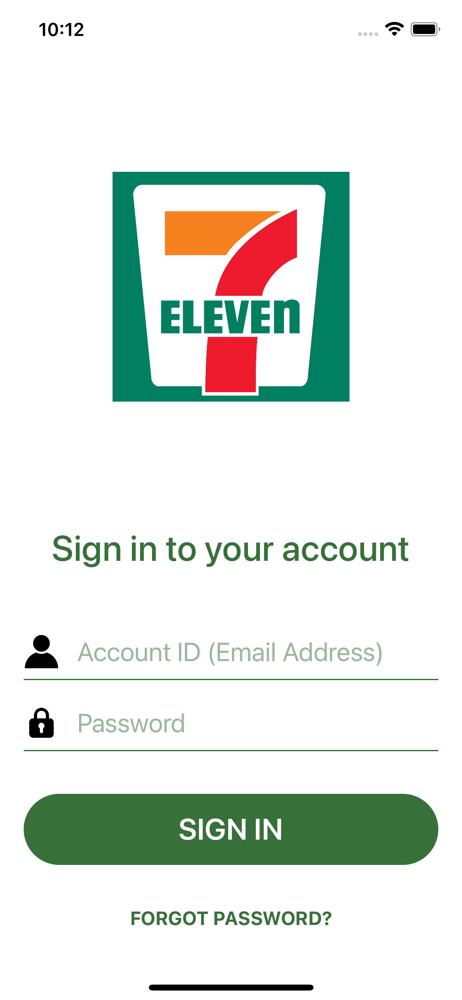
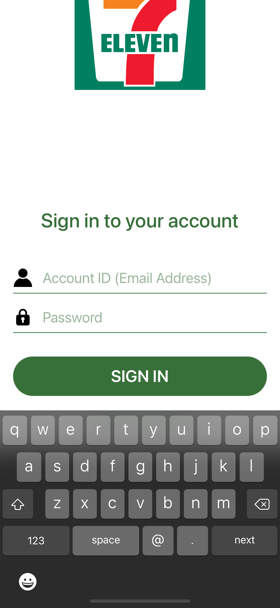
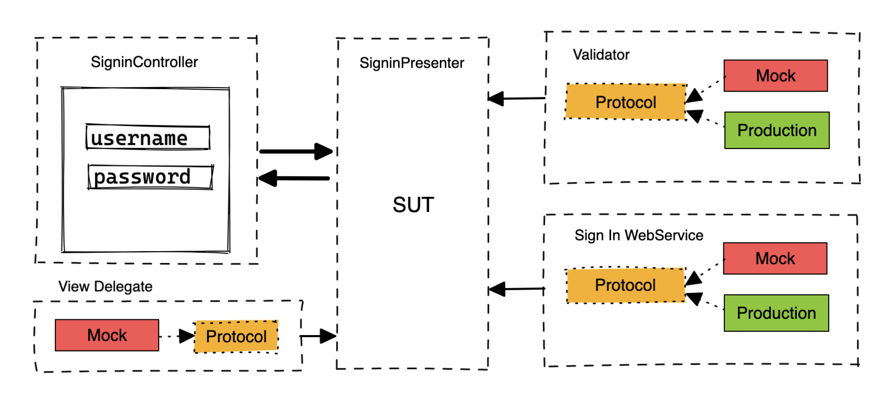
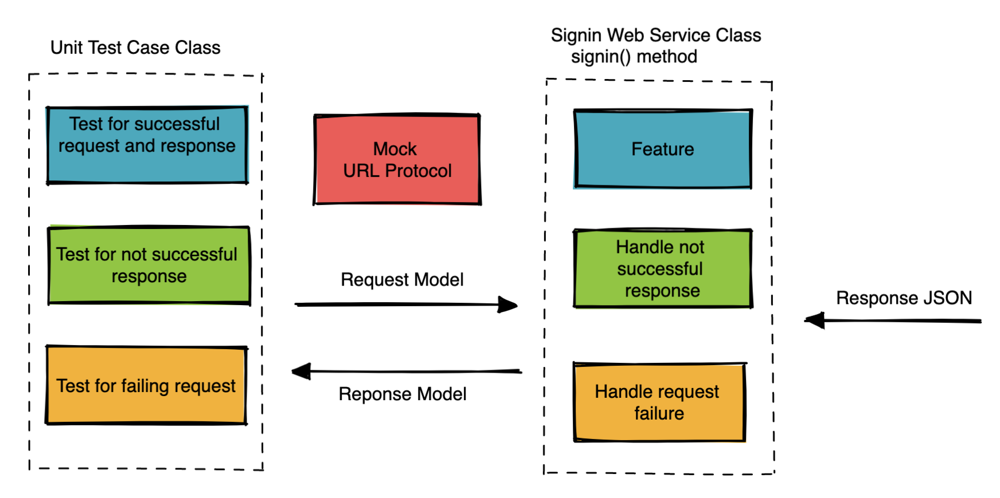
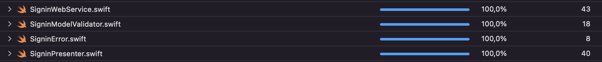

# swift_login_framework

## Requirements

Create a reusable log in framework:
- Login details can be stubbed.
- UI should be customizable.

## Features
- Programming language: Swift 
- MVP Pattern
- Protocol-Oriented Programming
- Dependency Injection
- Unit test: Test-Driven Development
- Customize UI: SimpleLayout & AdvancedLayout
- Support layout for all devices iPhone & iPad
- Network: URLSession, easy to replace with other third-party
- Observe Keyboard when user input
- Validator data input
- Error handling
- Build Swift Package as XCFramework
- Publishing LoginFrameworkPods using Cocoapods
- Continuous Integration: Github Actions <br /> <br />
[](https://github.com/oliver-anh-nguyen/swift_clean_mvvm_base/actions/workflows/ios.yml)

## Installation

To compile/run/test the LoginFramework:

- Open the Xcode Workspace Login.xcworkspace
- Select the LoginFramework scheme
- Run by pressing Play or by pressing [Cmd + R]

To compile/run the Demo iOS application using Framework:
- Open LoginFramework.xcodeproj
- Select the LoginDemo scheme
- Run by pressing Play or by pressing [Cmd + R]

To use Swift Package Manager
```swift
https://github.com/oliver-anh-nguyen/swift_package_login_framework
```
To use CocoaPods, add the following line to your Podfile:

```swift
pod 'LoginFrameworkPods'
```

## Usage example

1. Import the LoginFramework in your AppDelegate
```swift
import LoginFramework
```
2. In didFinishLaunchingWithOptions in your AppDelegate
- To show default Layout Signin
```swift
import UIKit
import LoginFramework
@main
class AppDelegate: UIResponder, UIApplicationDelegate {
    var window: UIWindow?
    func application(_ application: UIApplication, didFinishLaunchingWithOptions launchOptions: [UIApplication.LaunchOptionsKey: Any]?) -> Bool {
        self.window = UIWindow(frame: UIScreen.main.bounds)
        let signinViewController = SigninViewController()
        window?.rootViewController = signinViewController
        window?.makeKeyAndVisible()
        return true
    }
}
```
- To customize layout, we have two types of layout configuration: SimpleLayout & AdvancedLayout
```swift
let simpleLayout = SimpleLayout()
simpleLayout.primaryColor = UIColor(red: 56/255.0, green: 112/255.0, blue: 58/255.0, alpha: 1.0)
simpleLayout.backgroundColor = .red
simpleLayout.logoImage = UIImage(named: "logo.png")
simpleLayout.backgroundImage = UIImage(named: "background.png")
let signinViewController = SigninViewController()
signinViewController.layout = .Simple(layout: simpleLayout)
```
```swift
let advancedLayout = AdvancedLayout()
advancedLayout.linePassword.color = .green
advancedLayout.lineUsername.color = .green
advancedLayout.tfUsername.textColor = .blue
advancedLayout.tfPassword.textColor = .blue
advancedLayout.buttonForgot.fontColor = .blue
advancedLayout.imgLogo.image = UIImage(named: "logo.png")
advancedLayout.textSignin.font = UIFont.systemFont(ofSize: 17)
let signinViewController = SigninViewController()
signinViewController.layout = .Advanced(layout: advancedLayout)
```

## Screenshots

Default UI             |  Customize Simple Layout   |  Layout Input
:-------------------------:|:-------------------------:|:-------------------------:
 |  | 

## Unit testing: flow, coverage
- Presenter <br /> <br />
 <br />
- Network <br /> <br />
 <br />
- Coverage <br /> <br />
 <br />

## Build Framework Archives for XCFramework 
1. Open Terminal & cd to folder LoginFramework
2. Copy script below and paste to Terminal, then Enter
```swift
xcodebuild archive \
-scheme LoginFramework \
-configuration Release \
-destination 'generic/platform=iOS' \
-archivePath './build/LoginFramework.framework-iphoneos.xcarchive' \
SKIP_INSTALL=NO \
BUILD_LIBRARY_FOR_DISTRIBUTION=YES
xcodebuild archive \
-scheme LoginFramework \
-configuration Release \
-destination 'generic/platform=iOS Simulator' \
-archivePath './build/LoginFramework.framework-iphonesimulator.xcarchive' \
SKIP_INSTALL=NO \
BUILD_LIBRARY_FOR_DISTRIBUTION=YES
xcodebuild archive \
-scheme LoginFramework \
-configuration Release \
-destination 'platform=macOS,arch=x86_64,variant=Mac Catalyst' \
-archivePath './build/LoginFramework.framework-catalyst.xcarchive' \
SKIP_INSTALL=NO \
BUILD_LIBRARY_FOR_DISTRIBUTION=YES
xcodebuild -create-xcframework \
-framework './build/LoginFramework.framework-iphonesimulator.xcarchive/Products/Library/Frameworks/LoginFramework.framework' \
-framework './build/LoginFramework.framework-iphoneos.xcarchive/Products/Library/Frameworks/LoginFramework.framework' \
-framework './build/LoginFramework.framework-catalyst.xcarchive/Products/Library/Frameworks/LoginFramework.framework' \
-output './build/LoginFramework.xcframework'
```
3. It will generate to three xcarchive and folder xcframework in build folder. Sample
```swift
https://github.com/oliver-anh-nguyen/swift_login_framework/tree/main/build
```
